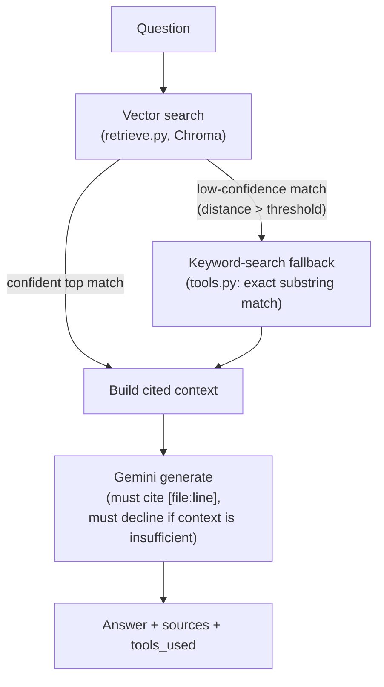

# Repo-QA Agent


A retrieval-augmented Q&A agent over a real codebase (indexed here: [Order-Processing-Pipeline](https://github.com/saijignas/Order-Processing-Pipeline)), with retrieval quality actually measured and a disclosed RAG-vs-no-retrieval comparison — not a "built a chatbot" demo.

**Why this exists:** several roles I'm applying to explicitly want "repository indexing, memory, and retrieval systems" and "agent-driven" work — this project is real, tested evidence of that, not a claim.

## Results at a glance

- **Retrieval precision@5: 0.83** (5/6 in-scope questions) — the one miss is root-caused below, not hidden
- **6/6 in-scope questions answered correctly with real `[file:line]` citations**, including one saved by the tool fallback after retrieval alone missed
- **2/2 out-of-scope questions correctly declined**, not hallucinated
- **17/17 tests pass** against real infrastructure (Chroma + live Gemini calls), 2 of which skip cleanly (not fake-pass) without an API key

## Quickstart

```
$ python agent.py "How does the consumer avoid double-processing an order if the same message gets redelivered?" ../Order-Processing-Pipeline --store ./chroma_store

ANSWER:
The consumer avoids double-processing redelivered messages through the following mechanisms:

*   **Idempotency Check:** Before performing any work, the consumer checks the order's status in Postgres. If the order is already marked as `completed`, the handler returns immediately with no side effects [README.md:35-43, consumer/worker.py:3-9].
*   **Atomic Database Transactions:** The `process_order` function uses a `SELECT ... FOR UPDATE` query at the start of the process. This creates an atomic critical section per `order_id` by locking the database row. If a redelivered message attempts to process the same order concurrently, it will block on the row lock until the first transaction completes, at which point it will re-read the state and see the `completed` status [consumer/worker.py:38-51].

SOURCES: ['README.md', 'consumer/worker.py', 'producer/app.py', 'shared/rabbitmq.py']
TOOLS USED: []
```
(Real, unedited output from a live run — reproduce it yourself with the Setup steps below.)

## Architecture



- **Ingestion** (`ingest.py`): walks the target repo, chunks each file into overlapping ~40-line windows (not syntax-aware — a real production indexer would chunk on function/class boundaries; disclosed as a limitation, not hidden), embeds with Chroma's local ONNX MiniLM model. Zero external API calls or quota cost for indexing.
- **Retrieval** (`retrieve.py`): pure vector search, kept separate from generation so retrieval quality can be measured and tested independently.
- **Tools** (`tools.py`): two, deliberately minimal — `search_keyword` (exact substring match, for identifiers/config values embedding similarity often under-ranks) and `fetch_file` (raw file read, for when a chunk isn't enough context).
- **Agent** (`agent.py`): an explicit, inspectable decision policy rather than a hidden free-form tool-call loop — retrieve, fall back to keyword search if the best match's distance is above a threshold, then generate an answer that must cite `[file:line]` for every claim and must decline explicitly if the context doesn't contain the answer, rather than filling gaps from general knowledge.
- **Generation**: Gemini API (`gemini-3.1-flash-lite`, chosen for free-tier quota headroom — same constraint discovered in [Consumer-Complaint-Triage](https://github.com/saijignas/Consumer-Complaint-Triage)). Key read from `GEMINI_API_KEY`, sent via request header, never logged or hardcoded.

## Evaluation

`eval/questions.json` — 8 hand-written questions: 6 in-scope (each tagged with the source file(s) that should answer it, for measuring retrieval precision) and 2 deliberately out-of-scope (to check the agent declines instead of hallucinating). `eval/run_eval.py` runs both retrieval-only precision@k and the full RAG-vs-no-context-baseline comparison; full transcript in `eval/eval_results.json`.

| ID | Question | Retrieval found the right file (top-5)? | Fallback tool fired? | Final answer | Verdict |
|----|----------|:---:|:---:|---|:---:|
| q1 | How does the consumer avoid double-processing a redelivered order? | ✅ | — | Cites the `SELECT ... FOR UPDATE` fix in `consumer/worker.py` | ✅ Correct |
| q2 | What happens after an order exhausts its retry budget? | ✅ | — | DLQ + `status=failed`, cited | ✅ Correct |
| q3 | What is `MAX_RETRIES` set to, and where? | ✅ (low confidence) | ✅ `search_keyword("MAX_RETRIES")` | "3, defined in `shared/rabbitmq.py:28`" | ✅ Correct |
| q4 | How does the producer prevent duplicate orders on retry? | ✅ | — | `Idempotency-Key` header, cited | ✅ Correct |
| q5 | How many consumer replicas run, and why? | ✅ | — | "1 replica — 1GB RAM limit", cited | ✅ Correct |
| q6 | What does CI actually test against — mocks or real services? | ❌ **Missed** (`ci.yml` not in top-5) | ✅ `search_keyword("pipeline")` → found `test_producer.py` | "Real services", correct — **recovered via fallback** | ✅ Correct |
| q7 | What color is the CEO's car? *(out-of-scope)* | n/a (irrelevant hits) | ✅ `search_keyword("color")` → 0 hits | Declined | ✅ Correct decline |
| q8 | What was the author's college GPA? *(out-of-scope)* | n/a (irrelevant hits) | ✅ `search_keyword("college")` → 0 hits | Declined | ✅ Correct decline |

### Spotlight: how q6 actually got answered correctly despite the retrieval miss

1. **Retrieve:** vector search for *"What does the CI pipeline actually test against — mocks or real services?"* returns `README.md`, `k8s/03-producer.yaml`, `tests/test_consumer.py`, `tests/test_producer.py` — **`.github/workflows/ci.yml` is not in the top-5**, even though it's the file that most directly answers the question. Root cause: fixed-size chunking gives YAML config weak semantic overlap with natural-language questions, compared to files with more prose — a known weakness of pure embedding search, and why production RAG systems often add a lexical (BM25-style) layer.
2. **Fallback trigger:** the top retrieved hit's distance is still above `LOW_CONFIDENCE_THRESHOLD`, so the agent automatically runs `search_keyword("pipeline")` as a second opinion — 8 exact-substring hits, including lines inside `tests/test_producer.py`.
3. **Final answer:** with the keyword hits folded into context, Gemini answers *"The CI pipeline tests against real services, specifically a real Postgres database and a real RabbitMQ instance, rather than mocks [tests/test_producer.py:1-2]."* — **correct**, but citing a different, indirect source than the one the question was designed around.
4. **What this proves, honestly:** the tool fallback compensated for a real retrieval gap this time. It won't always — if `test_producer.py`'s docstring hadn't also described the real-service setup, this question would have failed outright. That's a genuine limitation, not a solved problem.

Reproduce with:
```bash
python eval/run_eval.py ../Order-Processing-Pipeline --store ./chroma_store
```

## Tests

```bash
pip install -r requirements.txt
python -m pytest tests/ -v
```

17/17 pass with `GEMINI_API_KEY` set; 15 of those need no external API at all, and the other 2 (citation-correctness, decline-on-irrelevant-context) skip cleanly rather than fake-passing when the key isn't set.

## Setup

```bash
pip install -r requirements.txt
python ingest.py /path/to/target/repo          # builds ./chroma_store, no API key needed
export GEMINI_API_KEY=...                       # only needed for generation
python agent.py "your question here" /path/to/target/repo
```

## Engineering notes

The first real eval run hit a 429 (rate limited) partway through — the free Gemini tier caps requests-per-minute, not just per-day. Fixed with exponential backoff honoring the API's own `Retry-After` header, plus proactive pacing between eval questions (`llm_client.py`, `eval/run_eval.py`) — the same "don't just retry blindly, respect what the failure actually tells you" instinct as the retry/DLQ design in Order-Processing-Pipeline itself.

## Known limitations (disclosed, not fixed yet)

- Chunking is fixed-size, not syntax-aware — a function split across a chunk boundary loses context.
- Retrieval is pure semantic search; no lexical/BM25 hybrid layer yet, which is exactly what caused the q6 retrieval miss above.
- The low-confidence fallback threshold (`LOW_CONFIDENCE_THRESHOLD` in `agent.py`) was set from a small amount of empirical testing on one repo, not tuned across multiple repos or corpus sizes.

## Possible extensions

- **LangChain / LlamaIndex adapter:** the core (retrieval, decision policy, citation-grounded generation) is deliberately hand-rolled and framework-free — that's what makes it possible to test and reason about exactly (see the Architecture section above). A thin LangChain or LlamaIndex wrapper around the same core would be a natural add-on for roles that name those frameworks specifically, without rewriting the logic they'd just be wrapping.
- **Hybrid retrieval** (lexical + semantic) to fix the exact gap the q6 spotlight surfaced, rather than relying on the keyword-search fallback to catch it after the fact.
- **Syntax-aware chunking** (function/class boundaries via an AST parse) instead of fixed-size windows.
